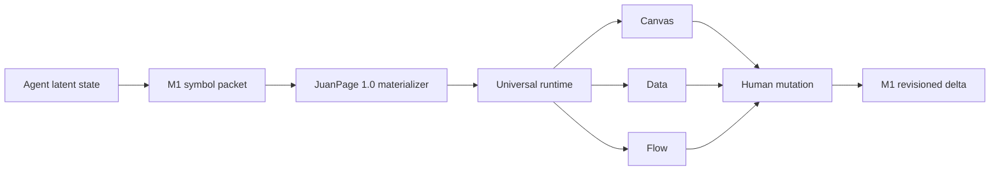

# JuanPager

**One schema for everything. One UI for everything. Meaning moves without requiring human words.**

JuanPager is a trusted runtime for the human side of agentic work. Agents may send the canonical JuanPage 1.0 object graph directly, or send an **M1 meaning packet** made of numeric opcodes, opaque symbols, typed values, relationships, signals, evidence, permissions, and actions.

M1 is not a second page schema or renderer. It compiles into JuanPage 1.0, then the existing universal runtime chooses the human projection.



## M1 packet

```json
[
  1,
  "packet:release",
  4,
  "vocabulary:en",
  [
    ["t:title", "Launch control"],
    ["type:release", "Release"],
    ["p:approved", "Approved"]
  ],
  [
    [0, [0, "t:title"], null, null, 2, 0, 0, 0],
    [1, "entity:release", "type:release", [1, "JuanPage 1.0"], null, null, 1, null, ["action:approve"], []],
    [2, "entity:release", "p:approved", false, [0, "p:approved"], 0, 1, null],
    [4, "action:approve", 0, [1, "Approve"], "entity:release", "p:approved", false, 2, null, "act:approve"]
  ]
]
```

The tuple positions are the contract. English exists only in the optional vocabulary projection. Another locale, accessibility surface, voice interface, or agent can supply a different vocabulary while retaining the same symbols and facts.

## Human-to-agent delta

When a person changes a rendered field, JuanPager emits a `juanpager:delta` browser event:

```json
[
  1,
  "packet:release",
  4,
  5,
  [[20, "entity:release", "p:approved", true]]
]
```

The agent receives a typed state transition, not a sentence to reinterpret.

## JuanPage 1.0

The canonical runtime still consumes one strict graph:

- `objects`: arbitrary typed things with stable IDs and ordered fields
- `relations`: directed connections between objects
- `actions`: trusted local human inputs
- `metrics`: count, sum, sum-product, progress, or fixed values
- `view`: starting lens, grouping, and density

M1 signals, evidence, and permission policies are projected as ordinary objects so the renderer remains universal and inspectable.

## Share format

```text
https://CakeRepository.github.io/juanpager/#v=3&enc=gz&data=ENCODED_PAYLOAD
```

The v3 payload may contain either a canonical JuanPage or an M1 envelope. Both render locally through the same security boundary.

## Run

```bash
npm install
npm run dev
npm test
npm run build
```

Viewer: `http://localhost:5173/juanpager/`

Builder: `http://localhost:5173/juanpager/builder.html`

## Security

JuanPager validates data and renders through trusted DOM APIs. It does not execute agent-authored HTML, JavaScript, CSS, scripts, iframes, or arbitrary network actions. URLs must use HTTPS, except localhost during development.

Do not place secrets or sensitive records in share links. URL fragments can appear in history, screenshots, bookmarks, and copied messages.

## License

MIT
