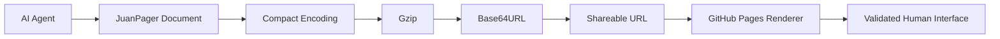

# JuanPager

JuanPager is a **serverless universal page renderer** for AI-generated interfaces.

An AI agent creates a compact, validated JSON document describing a page. That document is compressed and encoded into the URL fragment. A single static app hosted on GitHub Pages reads the fragment, validates it, and renders a polished mobile-responsive interface — with no backend, database, auth, React, or agent-generated HTML/JS/CSS.

```text
https://CakeRepository.github.io/juanpager/#data=COMPRESSED_BASE64URL_PAYLOAD
```



## The problem it solves

Agents are good at producing structured content, but shipping a custom mini-website for every answer is unsafe and brittle. JuanPager gives agents a **fixed component catalog** and a **single shareable link** that opens a trusted human UI.

## Why version 0.1 is serverless

No MCP server, backend, database, authentication, or SSR is required. The entire page travels in the URL fragment, so hosting is just static files on GitHub Pages.

## Why the document lives in the URL fragment

- Works offline after first load of the app shell
- No server round-trip to fetch page content
- Easy to copy, bookmark, and share
- Fragments are not sent to the GitHub Pages server as a request query

## Why arbitrary HTML is rejected

Executing agent HTML/JS/CSS would turn every link into an XSS vector. JuanPager only accepts data and renders it through trusted components.

## Supported component catalog

`heading` · `text` · `image` · `section` · `grid` · `card` · `product` · `price` · `badge` · `summary` · `list` · `checklist` · `divider` · `link` · `button`

Buttons are limited to local actions: `copy-page`, `copy-list`, `print-page`, `reset-state`, `open-all-links`.

## Security model

See [docs/SECURITY.md](docs/SECURITY.md). Highlights:

- Strict Zod validation
- Safe URL allowlist (`https:` + localhost in development)
- DOM-only rendering (no `innerHTML`)
- CSP suitable for GitHub Pages
- Local interaction state stays in `localStorage`, keyed by a hash of the decoded document

## Privacy warning

URL fragments may appear in:

- Browser history
- Bookmarks
- Screenshots
- Copied links
- Chat messages
- Shared documents

**Do not** use JuanPager embedded mode for passwords, API keys, access tokens, medical records, customer secrets, sensitive company data, or personal information that should not be shared.

Although fragments are not normally sent to the web server, they are still visible to anyone who receives or sees the URL.

## Payload limits (v0.1)

| Limit | Value |
| --- | --- |
| Encoded fragment | 16 KB |
| Decoded JSON | 64 KB |
| Components | 200 |
| Nesting depth | 8 |
| Text field | 2,000 chars |
| URL field | 2,048 chars |

## Sharing workflow

1. An AI agent creates a valid `JuanPagerDocument`.
2. The agent or helper tool runs the JuanPager encoder.
3. The encoder returns a shareable GitHub Pages URL.
4. The user opens the URL.
5. JuanPager renders the page locally.
6. Local interactions remain on that device.
7. Changing the source document creates a **new** URL.

Version 0.1 does **not** allow an agent to update an already-open page.

## Run locally

```bash
npm install
npm run dev
```

Open:

- Viewer: `http://localhost:5173/juanpager/`
- Builder: `http://localhost:5173/juanpager/builder.html`

Other scripts:

```bash
npm run build
npm test
npm run lint
```

## Builder

The built-in creator at `/builder.html` provides:

- JSON textarea
- Validate / Preview / Generate link / Copy link
- Encoded + decoded size indicators
- Validation errors
- Mobile and desktop previews
- Load grocery example

## CLI encoder / decoder

```bash
npm run encode -- examples/grocery-plan.json
npm run decode -- "http://localhost:5173/juanpager/#data=..."
```

Environment variable for the share base URL:

```bash
# preferred
JUANPAGER_BASE_URL=https://CakeRepository.github.io/juanpager/

# alias also supported
ONEPAGER_BASE_URL=https://CakeRepository.github.io/juanpager/
```

Default local base URL: `http://localhost:5173/`

For GitHub Pages locally, prefer:

```bash
JUANPAGER_BASE_URL=http://localhost:5173/juanpager/
```

## Deploy with GitHub Pages

1. Push to `main` on `CakeRepository/juanpager`.
2. In the repo settings, set Pages source to **GitHub Actions**.
3. The workflow `.github/workflows/pages.yml` builds with Vite base `/juanpager/` and deploys `dist/`.

If the repository name differs, change:

- `base` / `JUANPAGER_BASE` in `vite.config.ts` and the Pages workflow
- `public/config.js` → `basePath`
- documentation URLs

Production URL shape:

```text
https://CakeRepository.github.io/juanpager/
```

## How an AI agent should generate a document

See [docs/AGENT_GUIDE.md](docs/AGENT_GUIDE.md).

Short version: emit only validated JuanPager JSON using the component catalog, keep it compact, use HTTPS image URLs, and never emit HTML/JS/CSS or secrets.

## Current limitations

- No backend sync — checkbox/quantity state is device-local
- No remote document storage
- No agent live-update of an open page
- Conservative payload size limits
- Fixed component catalog only

## Future compatibility

Document loading is abstracted behind:

```ts
interface DocumentSource {
  load(): Promise<JuanPagerDocument>
}
```

Implemented now: `FragmentDocumentSource`.

Reserved for later: `RemoteDocumentSource` / MCP-backed sources. The renderer does not care whether a future document comes from a fragment, remote API, MCP, local file, or embedded app.

## License

MIT
