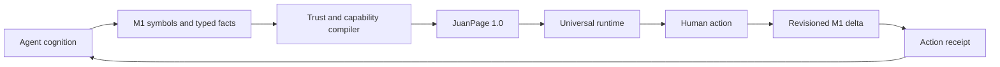

# JuanPager

**One schema for everything. One UI for everything. Meaning moves without requiring human words.**

JuanPager is an open-source semantic interaction runtime for humans and AI agents. Agents can send a canonical JuanPage 1.0 graph or an **M1 meaning packet** made of numeric opcodes, opaque symbols, typed facts, relationships, signals, evidence, permissions, and actions.

M1 does not render a second interface. It compiles into JuanPage 1.0, and the same trusted runtime projects that world as Canvas, Data, or Flow.



## Why this is different

Most generative UI systems ask an agent to describe components. JuanPager asks the agent to describe reality:

- stable entities and properties
- relationships and desired state
- evidence, confidence, and attention signals
- available operations and permission policy
- human mutations returned as typed deltas

English labels are only a vocabulary projection. The symbolic packet remains the same across locales, voice, mobile, accessibility surfaces, other agents, and future interfaces.

## Trust is executable

Permission records are enforced before rendering:

- **Allow** — the action is available.
- **Deny** — the action never reaches the renderer.
- **Approval required** — the action becomes a proposal and cannot mutate state directly.

Executable actions carry an idempotency key and produce lifecycle receipts: proposed, authorized, executing, succeeded, failed, rejected, or cancelled.

## M1 packet

```json
[
  1,
  "pkt:release",
  4,
  "vocab:en",
  [["txt:title", "Launch control"], ["type:release", "Release"]],
  [
    [0, [0, "txt:title"], null, null, 2, 0, 0, 0],
    [1, "e:release", "type:release", [1, "JuanPage 1.0"], null, null, 1, null, ["a:deploy"], []],
    [4, "a:deploy", 6, [1, "Deploy"], "e:release", null, ["e:release"], 2, null, "op:deploy"],
    [8, "a:deploy", 2, [1, "Deployment requires human approval"]]
  ]
]
```

The normative tuple definitions and opcode registry are in [`spec/M1.md`](spec/M1.md) and [`spec/opcodes.json`](spec/opcodes.json).

## Human-to-agent delta

```json
[
  1,
  "pkt:release",
  4,
  5,
  [[31, "mut:a:deploy:5", "actor:human:browser", "a:deploy", "e:release", {}, "idem:pkt:release:5:a:deploy", "2026-07-31T21:00:00.000Z"]]
]
```

The agent receives a typed proposal, not a sentence to reinterpret.

## SDK

The repository is configured to publish a typed ESM package. Until the first npm release is cut, build the SDK locally:

```bash
npm install
npm run build:sdk
```

```ts
import {
  materializeMeaningPacket,
  createActionDelta,
  createHttpTransport,
  toMcpAppResource,
} from "juanpager";

const page = materializeMeaningPacket(packet, capabilities);
const delta = createActionDelta(packet[1], packet[2], actorId, actionId, targetId, {}, "approval");
await createHttpTransport("https://agent.example/m1").send({ version: 1, kind: "delta", payload: delta });
const resource = toMcpAppResource(page);
```

Exports are prepared for `juanpager/protocol`, `juanpager/transport`, and `juanpager/adapters` when the package is published.

## Transport adapters

JuanPager includes framework-neutral adapters for:

- browser events
- `postMessage`
- HTTPS
- WebSocket
- in-memory testing

It also includes bridge models for A2UI-style surfaces, AG-UI state events, and MCP App resources. These bridges derive from JuanPage 1.0; they do not create alternate product schemas.

## Share format

```text
https://CakeRepository.github.io/juanpager/#v=3&enc=gz&data=ENCODED_PAYLOAD
```

The v3 payload may contain a canonical JuanPage or an M1 envelope. Content lives in the URL fragment and is rendered locally.

## Run

```bash
npm install
npm run check:one-runtime
npm test
npm run build
npm run benchmark:m1
npm run dev
```

Viewer: `http://localhost:5173/juanpager/`

Builder: `http://localhost:5173/juanpager/builder.html`

The builder accepts both raw M1 packets and JuanPage 1.0 documents.

## Security

JuanPager validates all data and renders only through trusted DOM APIs. It does not execute agent-authored HTML, JavaScript, CSS, scripts, iframes, or arbitrary component code. URLs must use HTTPS, except localhost during development.

Informational packets may be unsigned. External execution adapters should additionally verify issuer, audience, expiration, digest, and signature before accepting action mutations. Capability negotiation can remove unsupported actions but can never grant permission.

CI blocks high-severity vulnerabilities in production dependencies. Development-tool findings are tracked separately so they cannot be confused with shipped runtime exposure.

Do not put secrets in share links. URL fragments can appear in browser history, screenshots, bookmarks, and copied messages.

## Architecture invariant

There is exactly one public UI schema and one renderer:

```text
M1 transport → JuanPage 1.0 → renderPage
```

CI rejects retired runtime imports, alternate renderers, missing typed deltas, or executable M1 actions without receipt support.

## License

MIT
