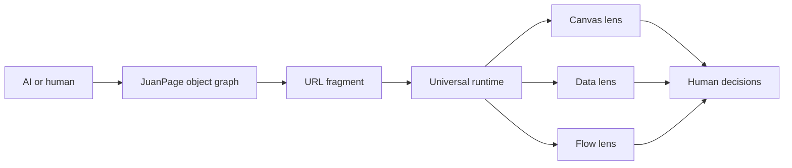

# JuanPager

**One schema for everything. One UI for everything.**

JuanPager is a trusted runtime for the human side of agentic work. AI and humans describe a world as objects, fields, relationships, metrics, and actions. JuanPager renders that world as the interface a person needs right now.

The agent does not write HTML, CSS, components, pages, or layouts.



## JuanPage 1.0

```json
{
  "version": "1.0",
  "title": "Launch control",
  "intent": "Decide what ships",
  "objects": [
    {
      "id": "release",
      "type": "release",
      "name": "JuanPage 1.0",
      "status": "Ready",
      "fields": [
        { "key": "risk", "value": "Low" },
        { "key": "approved", "value": false }
      ],
      "actionIds": ["approve"]
    }
  ],
  "actions": [
    {
      "id": "approve",
      "kind": "toggle",
      "label": "Approve",
      "target": "release",
      "field": "approved"
    }
  ]
}
```

That same document can be viewed as:

- **Canvas** — grouped, scannable human cards
- **Data** — a dense table derived from object fields
- **Flow** — lanes and relationships derived from the graph

Selecting any object opens one universal inspector. Its actions are rendered from the same schema.

## The universal contract

A JuanPage contains:

- `objects`: arbitrary typed things with stable IDs and ordered fields
- `relations`: directed connections between objects
- `actions`: local human inputs such as toggle, number, choice, text, open, copy, and emit
- `metrics`: count, sum, sum-product, progress, or fixed values
- `view`: a starting lens, grouping rule, and density preference

No entity catalog exists. A product, task, decision, endpoint, invoice, farm, person, model run, risk, or idea is simply an object.

## Share format

```text
https://CakeRepository.github.io/juanpager/#v=3&enc=gz&data=ENCODED_JUANPAGE
```

- `gz`: gzip-compressed JSON for compact links
- `raw`: plain JSON encoded as Base64URL for inspection
- content lives in the URL fragment and is rendered locally

## Run

```bash
npm install
npm run dev
npm test
npm run build
```

Viewer: `http://localhost:5173/juanpager/`

Builder: `http://localhost:5173/juanpager/builder.html`

Encode or decode:

```bash
npm run encode -- examples/one-schema.json
npm run decode -- "https://example/#v=3&enc=gz&data=..."
```

## Security

JuanPager accepts data, validates it with Zod, and renders through trusted DOM APIs. It does not execute agent-authored HTML, JavaScript, CSS, scripts, iframes, or arbitrary network actions. URLs must use HTTPS, except localhost during development.

Do not place secrets or sensitive records in share links. Fragments can appear in history, screenshots, bookmarks, and copied messages.

## Deliberate break from pre-1.0

The public viewer, builder, CLI, and share format now target one contract only: **JuanPage 1.0**.

The old component-tree and moment implementations remain in repository history for reference, but the product no longer branches between them. The future surface is a graph, not a component catalog.

## License

MIT
