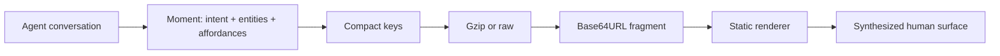

# JuanPager

JuanPager is the **shareable human surface at the end of an agent conversation**.

An agent finishes reasoning and needs to hand a person something they can actually use: a checkout to review, a list to shop, options to weigh. Instead of generating a mini-website, the agent emits a **moment** — an intent, a set of facts, and the affordances the reader should have. One trusted static app reads that and synthesizes the interface at runtime.

```text
https://CakeRepository.github.io/juanpager/#v=2&enc=gz&data=ENCODED_MOMENT
```



No backend, no database, no auth, no SSR, no React, and no agent-authored HTML/JS/CSS.

## The proving story

A meal-planning conversation ends with a grocery checkout you can open on your phone in the store: line items grouped by shop, quantities you can adjust, checkboxes that survive the walk down the aisle, a live estimated total, and a copyable list. The agent never described a single pixel.

```bash
npm run encode -- examples/grocery-checkout.json
```

## Why a moment instead of a component tree

Version 0.1 let agents lay out components. That works, but it makes every agent responsible for design, and it freezes the interface at generation time.

In 0.2 the agent answers three questions:

1. **What is this for?** — `moment: "confirm" | "track" | "choose" | "inspect" | "compare" | "collect" | "browse"`
2. **What is it about?** — `entities`: products, notes, links (plus optional `groups`)
3. **What may the reader do?** — `affordances`: `check`, `adjust-qty`, `copy-list`, `print`, `reset`, `open-links`, `copy-page`

The app owns composition, so the same link gets better as the renderer improves. 0.1 documents keep working unchanged.

## Moment shape

```json
{
  "version": "0.2",
  "title": "Justin's Four-Day Grocery Checkout",
  "moment": "confirm",
  "goal": "Review and shop this high-protein plan",
  "summary": [{ "label": "Estimated total", "value": "$63.40 (sample)" }],
  "entities": [
    {
      "type": "product",
      "id": "greek-yogurt",
      "name": "Plain Greek Yogurt",
      "store": "Costco",
      "price": 5.99,
      "currency": "USD",
      "quantity": 2,
      "reason": "Two tubs cover breakfast every morning of the plan."
    }
  ],
  "groups": [{ "id": "costco", "label": "Costco", "entityIds": ["greek-yogurt"] }],
  "affordances": ["check", "adjust-qty", "copy-list", "print", "reset"],
  "continuation": { "kind": "note", "text": "Nothing is ordered from this page." }
}
```

Each moment renders a different composition: `confirm` becomes a checkout with an order summary, `track` a grouped checklist with progress, `choose` selectable cards, `inspect` a hero detail, `compare` side-by-side columns, `collect` a notes-and-links panel, `browse` dense scannable rows.

## The Juan dialect

Agents that would rather write text than JSON can emit the dialect, which compiles to a moment:

```text
# Justin's Four-Day Grocery Checkout
moment: confirm
goal: Review and shop this high-protein plan

summary:
- Estimated total | $63.40 (sample)
- Stores | ALDI · Costco · Trader Joe's

## ALDI
- [ ] Greek Yogurt · $4.29 · qty 2 · why: breakfast protein · https://example.com/aldi-yogurt
- [ ] Eggs · $2.89 · qty 1

affordances: check, adjust-qty, copy-list, print, reset, open-links
```

```bash
npm run encode -- examples/grocery-checkout.juan
```

Full grammar: [docs/AGENT_GUIDE.md](docs/AGENT_GUIDE.md).

## Encoding

| Fragment | Payload |
| --- | --- |
| `#v=2&enc=gz&data=…` | Moment, compact keys + gzip. Default; shortest links. |
| `#v=2&enc=raw&data=…` | Moment, plain JSON in Base64URL. Larger, but inspectable and fails loudly. |
| `#v=1&data=…` | 0.1 document, compact keys + gzip. |

Decoding trusts the bytes over the declared encoding: a payload that claims gzip and lacks a gzip header is reported as truncated or corrupted rather than failing cryptically. Missing `enc` defaults to gzip and is sniffed.

## Why the document lives in the URL fragment

- Works offline after the first load of the app shell
- No server round-trip to fetch page content
- Easy to copy, bookmark, and share
- Fragments are not sent to the server as a request query

## Why arbitrary HTML is rejected

Executing agent HTML/JS/CSS would turn every link into an XSS vector. JuanPager accepts data only and renders it through trusted code.

## Security model

See [docs/SECURITY.md](docs/SECURITY.md). Highlights:

- Strict Zod validation on both document families; unknown keys are rejected
- Safe URL allowlist (`https:` + localhost in development)
- DOM-only rendering (no `innerHTML`, no agent class names, no `script`/`iframe`/`style`)
- CSP suitable for GitHub Pages
- Affordances cannot reach the network; local state stays in `localStorage`, keyed by a hash of the decoded document

## Privacy warning

URL fragments may appear in browser history, bookmarks, screenshots, copied links, chat messages, and shared documents.

**Do not** embed passwords, API keys, access tokens, medical records, customer secrets, or personal information that should not be shared. Fragments are not normally sent to the server, but they are visible to anyone who receives the URL.

## Limits

| Limit | Value |
| --- | --- |
| Encoded fragment | 16 KB |
| Decoded JSON | 64 KB |
| Entities (0.2) | 100 |
| Groups (0.2) | 25 |
| Summary rows (0.2) | 12 |
| Components (0.1) | 200 |
| Nesting depth (0.1) | 8 |
| Text field | 2,000 chars |
| URL field | 2,048 chars |

The focus set is deliberately small: a moment is what a person can act on, not a database dump. Remote-storage mode is reserved for later.

## Sharing workflow

1. An agent emits a moment (JSON or dialect).
2. The encoder returns a shareable URL.
3. The reader opens it; the app validates and renders locally.
4. Checkboxes and quantities stay on that device.
5. Changing the source produces a **new** URL — an agent cannot update an already-open page.

## Run locally

```bash
npm install
npm run dev
```

Open:

- Viewer: `http://localhost:5173/juanpager/`
- Builder: `http://localhost:5173/juanpager/builder.html`

Other scripts:

```bash
npm run build
npm test
npm run test:e2e
npm run lint
```

## Builder

`/builder.html` has three source modes:

- **Moment JSON (0.2)** — the preferred format
- **Juan dialect** — paste text, compile to a moment
- **Document JSON (0.1)** — the legacy component tree

Plus validation with readable errors, mobile and desktop previews, gzip/raw encoding choice, encoded and decoded size meters, and one-click example loading.

## CLI encoder / decoder

```bash
npm run encode -- examples/grocery-checkout.json
npm run encode -- examples/grocery-checkout.json --raw
npm run encode -- examples/grocery-checkout.juan
npm run encode -- examples/grocery-plan.json          # 0.1 still works
npm run decode -- "http://localhost:5173/juanpager/#v=2&enc=gz&data=..."
```

The encoder prints the URL on stdout and a size report on stderr, so `npm run --silent encode -- file.json` pipes cleanly.

Base URL environment variables:

```bash
JUANPAGER_BASE_URL=https://CakeRepository.github.io/juanpager/
ONEPAGER_BASE_URL=https://CakeRepository.github.io/juanpager/   # alias
```

Default local base URL: `http://localhost:5173/`. For GitHub Pages locally, prefer `http://localhost:5173/juanpager/`.

## Deploy with GitHub Pages

1. Push to `main` on `CakeRepository/juanpager`.
2. In repo settings, set Pages source to **GitHub Actions**.
3. `.github/workflows/pages.yml` builds with Vite base `/juanpager/` and deploys `dist/`.

If the repository name differs, change `base` / `JUANPAGER_BASE` in `vite.config.ts` and the Pages workflow, `public/config.js` → `basePath`, and documentation URLs.

## How an agent should generate a moment

See [docs/AGENT_GUIDE.md](docs/AGENT_GUIDE.md). Short version: pick the moment, state the goal, list entities with ids and reasons, choose affordances, keep it compact, use HTTPS URLs, and never emit HTML/JS/CSS or secrets.

## Current limitations

- No backend sync — checkbox and quantity state is device-local
- No remote document storage; `continuation` cannot yet call anything
- No agent live-update of an open page
- Conservative payload limits
- Fixed entity and affordance catalogs

## Future compatibility

Loading is abstracted behind:

```ts
interface DocumentSource {
  load(): Promise<LoadedDocument>
}
```

`LoadedDocument` is a discriminated union of `{ kind: "moment" }` and `{ kind: "components" }`, so new sources and new formats can be added without touching the renderers. Implemented now: `FragmentDocumentSource`. Reserved: `RemoteDocumentSource` / MCP-backed sources.

## License

MIT
